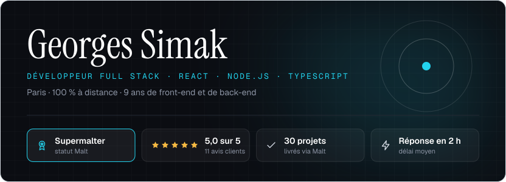
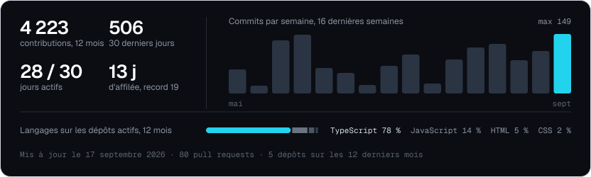
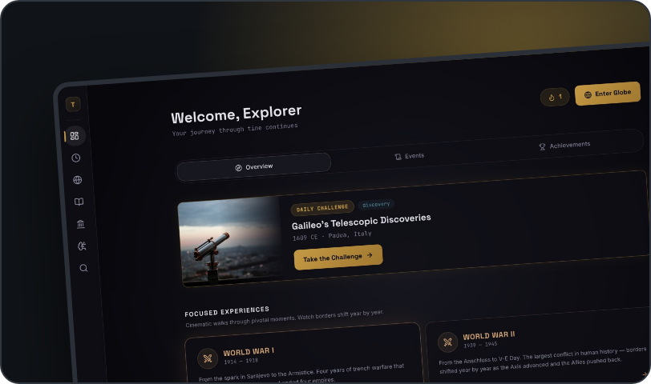

<picture><source media="(prefers-color-scheme: dark)" srcset="assets/banner-dark.svg"> </picture>

<a href="https://www.linkedin.com/in/georgsima/"><picture><source media="(prefers-color-scheme: dark)" srcset="assets/btn-linkedin-dark.svg"> </picture></a>

Je conçois et livre des applications web complètes, du MVP jusqu'à la mise en production. Front React / Next.js / TypeScript, APIs Node.js sécurisées sur PostgreSQL, intégration d'IA (LLM, voix, RAG) dans des produits neufs ou existants. Ce profil ne montre que mes projets personnels.

## En ce moment

<picture><source media="(prefers-color-scheme: dark)" srcset="assets/activity-dark.svg"> </picture>

## Projets personnels

<table width="832">
<tr>
<td width="50%" valign="top">

<b>BookSwipe</b> &nbsp;·&nbsp; <a href="https://book-swipe-tau.vercel.app">site</a> &nbsp;·&nbsp; <a href="https://github.com/gs-imak/book-swipe">code</a> 
Découverte de livres par swipe, lecteur intégré pour le domaine public. <code>Next.js 16 · PWA · Supabase</code>
</td>
<td width="50%" valign="top">

<b>TimeScroll</b> &nbsp;·&nbsp; <a href="https://time-scroll-sand.vercel.app">site</a> 
Carte 3D interactive de l'histoire mondiale, navigation par époque. <code>React 19 · CesiumJS · Three.js · NestJS</code>
</td>
</tr>
</table>

<picture><source media="(prefers-color-scheme: dark)" srcset="assets/stack-dark.svg"> </picture>

<table width="832">
<tr>
<td width="33%" valign="top"><b>LIVRAISON</b> Fréquente, testable, une PR par tranche avec la preuve attachée.</td>
<td width="33%" valign="top"><b>CODE</b> TypeScript de bout en bout, tests, CI/CD qui bloque.</td>
<td width="33%" valign="top"><b>CONTACT</b> <a href="https://www.linkedin.com/in/georgsima/">LinkedIn</a></td>
</tr>
</table>
